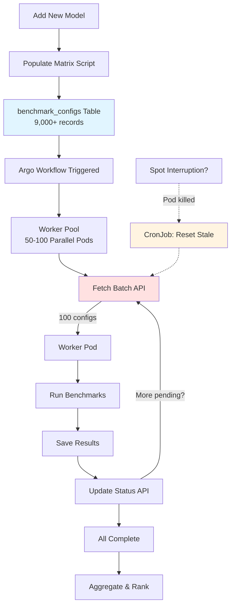

# Argo Workflows - Benchmark Orchestration

## Overview

This directory contains Argo Workflow definitions for orchestrating large-scale LLM benchmarking across 1,000-9,000+ test configurations per model.

**Key Features:**
- 🗄️ Database-driven orchestration (no 1MB Argo limit)
- 🔒 Race-condition-safe config fetching
- 🔄 Automatic spot instance recovery
- ⚡ Parallel batch processing (50-100 pods)
- 📊 Real-time progress tracking

---

## Architecture



### Data Flow

1. **Matrix Population** → Creates `benchmark_configs` with status='pending'
2. **API: get-batch** → Atomically fetches configs, marks as 'running'  
3. **Workers** → Run benchmarks, save results  
4. **API: update-status** → Mark 'completed' or 'failed'
5. **CronJob** → Reset stale 'running' configs (spot recovery)

---

## Workflows

### 1. `benchmark-workflow-v2.yaml` 

**Main benchmarking workflow** - Database-driven orchestration (v2)

#### Parameters

| Parameter | Default | Description |
|-----------|---------|-------------|
| `model-version-id` | (required) | UUID of model version to benchmark |
| `batch-size` | `100` | Configs fetched per API call (1-500) |
| `api-base-url` | `http://model-catalog-api:8000` | API endpoint |
| `max-parallel-pods` | `50` | Maximum concurrent worker pods |

#### Usage

```bash
# Submit workflow
argo submit configs/argo/benchmark-workflow-v2.yaml \
  -p model-version-id="123e4567-e89b-12d3-a456-426614174000" \
  -p batch-size="100" \
  -p max-parallel-pods="50"

# Watch progress
argo watch model-benchmark-pipeline-v2-xxxxx

# View logs
argo logs model-benchmark-pipeline-v2-xxxxx
```

#### Steps

1. **populate-matrix**: Generates 9,000+ configs in database
2. **benchmark-worker-pool**: Spawns parallel worker pods
3. **finalize**: Aggregates results and updates rankings

---

### 2. `spot-handler.yaml`

**Spot instance recovery** - CronWorkflow and CronJob implementations

#### Purpose

Automatically recovers from spot instance interruptions by resetting stale 'running' configs back to 'pending'.

#### Schedule

Runs **every 30 minutes**

#### How It Works

```sql
-- Finds configs stuck in 'running' > 2 hours
UPDATE benchmark_configs
SET status = 'pending', started_at = NULL, retry_count = retry_count + 1
WHERE status = 'running' AND started_at < NOW() - INTERVAL '2 hours';
```

#### Deploy

**Option 1: Argo CronWorkflow** (if using Argo)
```bash
kubectl apply -f configs/argo/spot-handler.yaml
```

**Option 2: Kubernetes CronJob** (alternative)
```bash
# Uses the CronJob section in spot-handler.yaml
kubectl apply -f configs/argo/spot-handler.yaml
```

#### Monitoring

```bash
# View CronWorkflow runs
argo cron list -n gpu-workloads
argo cron get spot-instance-recovery -n gpu-workloads

# View CronJob runs
kubectl get cronjobs -n gpu-workloads
kubectl logs -n gpu-workloads job/spot-instance-recovery-cronjob-xxxxx
```

---

## Quick Start

### Prerequisites

1. **Database seeded** with reference data:
   ```bash
   python scripts/db/seed_benchmark_data.py
   ```

2. **Kubernetes secrets** created:
   ```bash
   kubectl create secret generic model-catalog-secrets \
     --from-literal=DATABASE_URL="postgresql+asyncpg://..." \
     -n gpu-workloads
   ```

3. **GPU nodes** available with proper taints:
   ```bash
   kubectl get nodes -l node.kubernetes.io/instance-type=p4d.24xlarge
   ```

### Step-by-Step Workflow

#### 1. Populate Matrix

```bash
# Dry run to see expected config count
python scripts/workflows/populate_matrix.py <model-version-id> --dry-run

# Actually create configs
python scripts/workflows/populate_matrix.py <model-version-id>
```

**Output:**
```
📊 Benchmark Matrix Population
Model Version ID: 123e4567...
Hardware Configs: 10
Frameworks: 3
Expected Total: 1,800 configs

✅ Successfully created 1,800 benchmark configurations!
```

#### 2. Deploy Spot Handler

```bash
kubectl apply -f configs/argo/spot-handler.yaml
```

#### 3. Submit Workflow

```bash
argo submit configs/argo/benchmark-workflow-v2.yaml \
  -p model-version-id="123e4567-e89b-12d3-a456-426614174000"
```

#### 4. Monitor Progress

**Via Argo CLI:**
```bash
argo list -n gpu-workloads
argo get model-benchmark-pipeline-v2-xxxxx
argo logs -f model-benchmark-pipeline-v2-xxxxx
```

**Via API:**
```bash
curl http://model-catalog-api:8000/api/v1/workflow/progress/123e4567...
```

**Response:**
```json
{
  "total": 1800,
  "pending": 400,
  "running": 100,
  "completed": 1200,
  "failed": 100,
  "progress_pct": 66.67
}
```

---

## Monitoring & Troubleshooting

### Check Workflow Status

```bash
# List all workflows
argo list -n gpu-workloads

# Get specific workflow details
argo get model-benchmark-pipeline-v2-xxxxx

# Watch live
argo watch model-benchmark-pipeline-v2-xxxxx
```

### Database Queries

#### Status Distribution
```sql
SELECT status, COUNT(*)
FROM benchmark_configs
WHERE model_version_id = '<uuid>'
GROUP BY status;

-- Example output:
-- pending    | 300
-- running    | 100
-- completed  | 1400
-- failed     | 0
```

#### Find Stale Configs
```sql
SELECT id, hardware_config_id, workload_type, started_at
FROM benchmark_configs
WHERE status = 'running'
  AND started_at < NOW() - INTERVAL '2 hours';
```

#### Failed Configs Analysis
```sql
SELECT error_message, COUNT(*)
FROM benchmark_configs
WHERE status = 'failed' AND model_version_id = '<uuid>'
GROUP BY error_message
ORDER BY COUNT(*) DESC;
```

#### Progress Over Time
```sql
SELECT
  DATE_TRUNC('hour', completed_at) as hour,
  COUNT(*) as configs_completed
FROM benchmark_configs
WHERE status = 'completed' AND model_version_id = '<uuid>'
GROUP BY hour
ORDER BY hour;
```

### Common Issues

#### 1. No Pending Configs

**Symptom:** API returns empty batch `[]`

**Possible Causes:**
- Matrix not populated
- All configs already completed
- Priority threshold too low

**Fix:**
```bash
# Check if matrix exists
curl http://api:8000/api/v1/workflow/progress/<model-version-id>

# If total=0, populate matrix
python scripts/workflows/populate_matrix.py <model-version-id>

# If all completed, workflow is done
```

#### 2. Configs Stuck in 'running'

**Symptom:** Progress shows high 'running' count but no pods

**Cause:** Spot instance interruptions

**Fix:**
```bash
# Manual trigger spot handler
curl -X POST "http://api:8000/api/v1/workflow/maintenance/reset-stale?timeout_minutes=120"

# Or wait for CronJob (runs every 30min)
```

#### 3. Pod OOM Killed

**Symptom:** Pods fail with exit code 137

**Cause:** Model too large for memory limits

**Fix:**
```yaml
# Edit benchmark-workflow-v2.yaml
resources:
  limits:
    memory: 64Gi  # Increase from 32Gi
```

#### 4. GPU Not Available

**Symptom:** Pods stuck in 'Pending' state

**Cause:** No GPU nodes match affinity rules

**Fix:**
```bash
# Check GPU node availability
kubectl get nodes -l nvidia.com/gpu.present=true

# Check node taints
kubectl describe node <node-name> | grep -A 5 Taints

# Adjust affinity in workflow or add nodes
```

#### 5. Database Connection Pool Exhausted

**Symptom:** Errors like "connection pool exhausted"

**Cause:** Too many parallel pods

**Fix:**
```bash
# Reduce parallel pods
argo submit ... -p max-parallel-pods="25"

# Or increase DB pool size in API config
```

---

## API Endpoints

All endpoints are under `/api/v1/workflow`

### Get Pending Batch

```http
POST /api/v1/workflow/configs/get-batch
Content-Type: application/json

{
  "limit": 100,
  "priority_threshold": 1000
}
```

**Response:** Array of configs (atomically marked as 'running')

### Update Config Status

```http
POST /api/v1/workflow/configs/{config_id}/status
Content-Type: application/json

{
  "status": "completed"
}
```

or

```json
{
  "status": "failed",
  "error_message": "OOM killed during inference"
}
```

### Get Progress

```http
GET /api/v1/workflow/progress/{model_version_id}
```

### Reset Stale Configs

```http
POST /api/v1/workflow/maintenance/reset-stale?timeout_minutes=120
```

### List Configs

```http
GET /api/v1/workflow/configs/{model_version_id}?status=failed&limit=100
```

---

## Performance Tuning

### Batch Size

| Batch Size | Pros | Cons |
|-----------|------|------|
| 50 | Lower DB load | More API calls overhead |
| 100 | ✅ **Optimal balance** | - |
| 200 | Fewer API calls | Higher memory per pod |

**Recommendation:** 100 configs per batch

### Parallel Pods

| Parallel Pods | GPU Cluster Size | Expected Runtime (1,800 configs) |
|--------------|------------------|----------------------------------|
| 10 | Small | ~3 hours (1 min/config) |
| 50 | Medium | ~36 minutes |
| 100 | Large | ~18 minutes |

**Recommendation:** 50-100 pods optimal

**Constraints:**
- Database connection pool size (default: 200)
- GPU node availability
- Kubernetes API rate limits

### Priority Configuration

Configure in `populate_matrix.py`:

```python
def calculate_priority(workload, batch_size, sequence_length):
    base_priority = {
        "chatbot": 100,          # Highest - interactive workload
        "qa": 200,               # High - latency-sensitive
        "code-generation": 300,  # Medium - mixed requirements
        "creative-writing": 400, # Low - quality over speed
        "summarization": 500     # Lowest - batch processing
    }
    # ... adjustments for batch_size and sequence_length
```

---

## Best Practices

### 1. **Start Small**
Test with one model before scaling:
```bash
python populate_matrix.py <model-id> --dry-run  # Preview
python populate_matrix.py <model-id>            # Populate
argo submit ... -p max-parallel-pods="10"       # Limited parallelism
```

### 2. **Monitor Database**
Watch connection count during workflow:
```sql
SELECT count(*) FROM pg_stat_activity WHERE datname = 'model_catalog';
```

### 3. **Use Spot Instances**
Configure node pools with spot instances for 60-70% cost savings

### 4. **Set Resource Limits**
Prevent resource exhaustion:
```yaml
resources:
  requests:  # Guaranteed
    nvidia.com/gpu: 1
    memory: 16Gi
  limits:    # Maximum
    nvidia.com/gpu: 1
    memory: 32Gi  # 2x request allows burst
```

### 5. **Archive Completed Configs**
After workflow completes, optionally archive:
```sql
-- Archive configs older than 90 days
DELETE FROM benchmark_configs
WHERE status = 'completed'
  AND completed_at < NOW() - INTERVAL '90 days';
```

---

## Maintenance

### Weekly Tasks

- Review failed configs:
  ```bash
  curl "http://api:8000/api/v1/workflow/configs/<model-id>?status=failed"
  ```

- Check spot handler effectiveness:
  ```bash
  kubectl logs -n gpu-workloads -l app=spot-handler --tail=100
  ```

### Monthly Tasks

- Analyze performance trends:
  ```sql
  SELECT workload_type, AVG(retry_count) as avg_retries
  FROM benchmark_configs
  WHERE status IN ('completed', 'failed')
  GROUP BY workload_type;
  ```

- Optimize priority weights based on business needs

---

## Migration from v1

If migrating from old workflow (`benchmark-workflow.yaml`):

1. **Database changes**: Run Alembic migration
2. **Populate existing models**: Run populate_matrix.py for each model
3. **Deploy v2 workflow**: `kubectl apply -f benchmark-workflow-v2.yaml`
4. **Deprecate v1**: Remove old workflow after validation
5. **Monitor**: Compare runtimes and resource usage

**Backward Compatibility:**
- `config_id` in `benchmark_results` is nullable
- Existing results continue working
- New results link to configs

---

## Support & Resources

- **Architecture Docs**: `docs/DATABASE.md` (Benchmark Configuration Matrix section)
- **API Docs**: `http://api:8000/docs` (FastAPI Swagger UI)
- **Argo Docs**: https://argoproj.github.io/argo-workflows/
- **Troubleshooting**: See "Monitoring & Troubleshooting" section above

---

## Example: Complete Workflow Run

```bash
# 1. Verify setup
python scripts/db/seed_benchmark_data.py

# 2. Populate matrix
python scripts/workflows/populate_matrix.py 123e4567-e89b-12d3-a456-426614174000

# Output:
# ✅ Successfully created 1,800 benchmark configurations!

# 3. Deploy spot handler
kubectl apply -f configs/argo/spot-handler.yaml

# 4. Submit workflow
argo submit configs/argo/benchmark-workflow-v2.yaml \
  -p model-version-id="123e4567-e89b-12d3-a456-426614174000" \
  -p max-parallel-pods="50"

# 5. Monitor progress
argo watch model-benchmark-pipeline-v2-xdhgb

# 6. Check progress via API
curl http://api:8000/api/v1/workflow/progress/123e4567-e89b-12d3-a456-426614174000

# 7. View results
# Progress: 1800/1800 (100%)
# Estimated completion: In 2 minutes

# 8. Workflow completes
# ✅ All benchmarks completed successfully
```

---

**Last Updated:** 2024-10-22  
**Version:** 2.0  
**Status:** Production Ready


