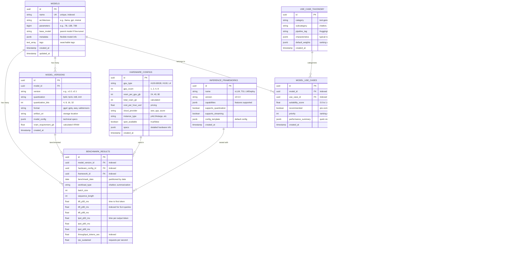
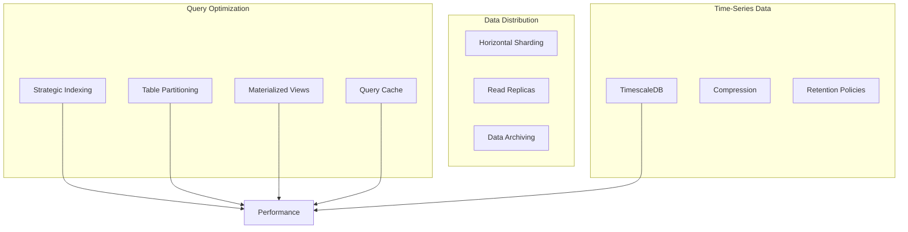
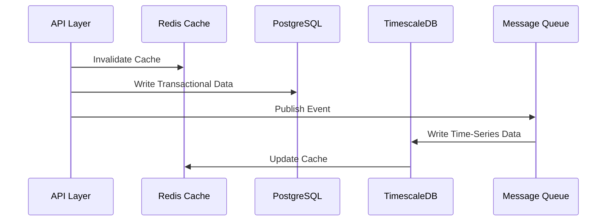
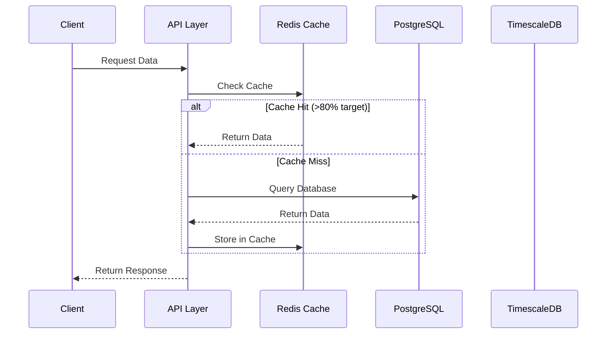
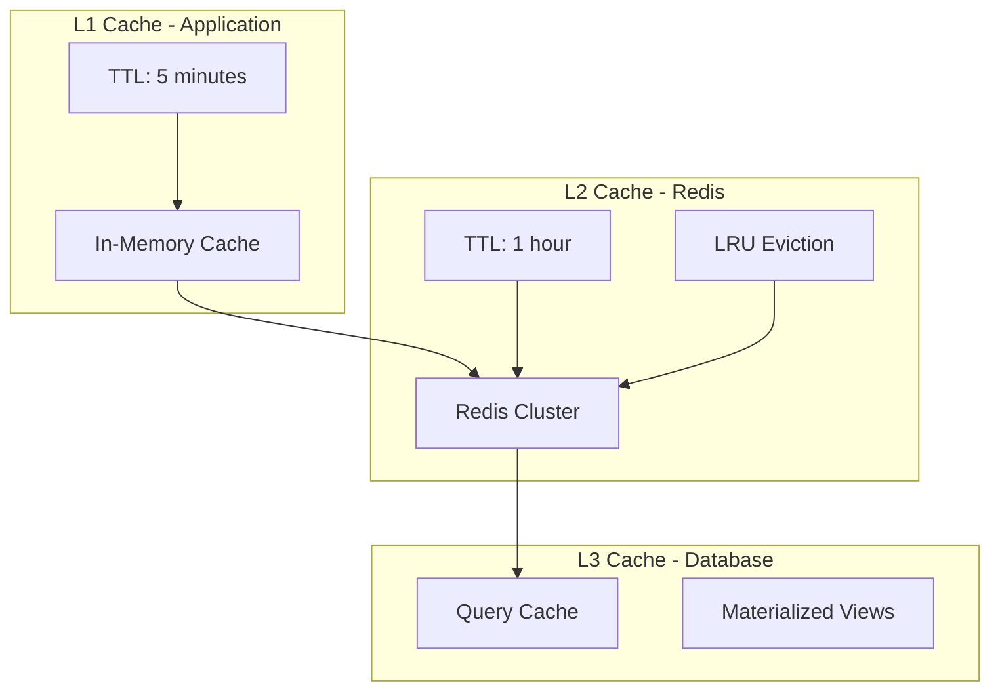
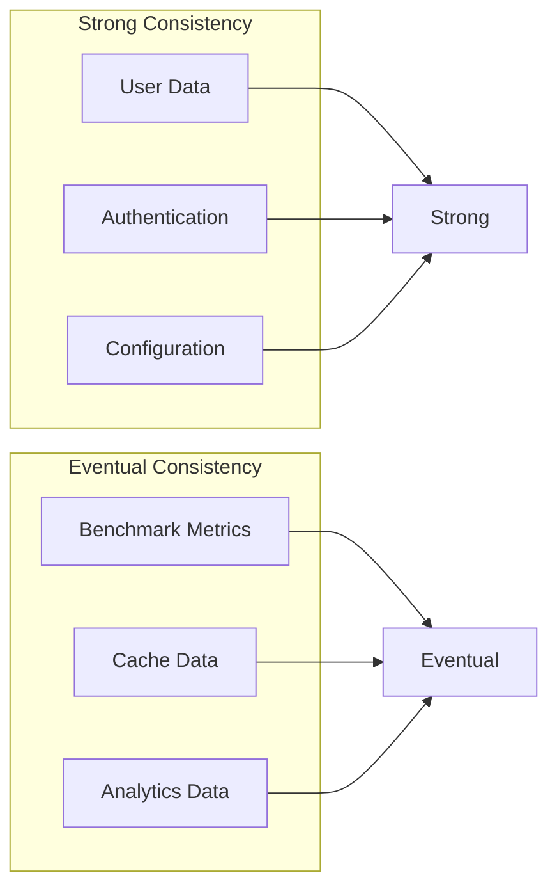
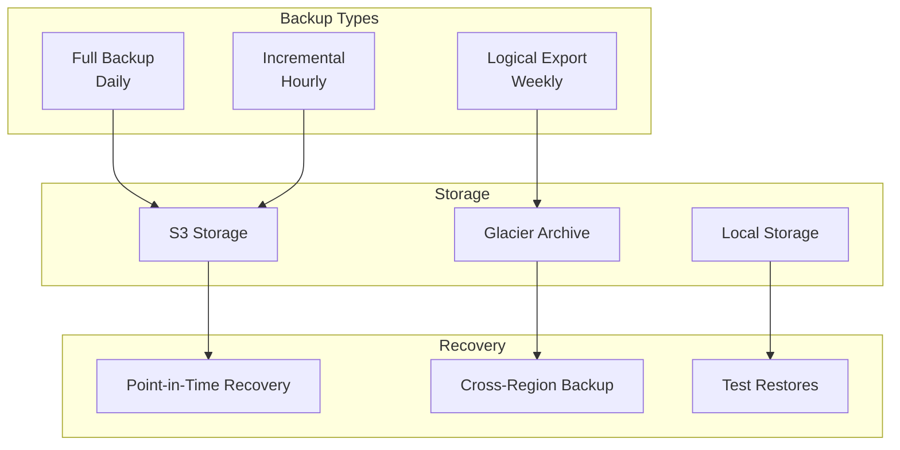

# Database Architecture

## Database Schema (ERD)

### Core Entities



## Schema Design Overview

### Entity Relationships

The database schema is designed around the core entities that support the LLM benchmarking platform with large-scale performance testing across 9,000+ configurations per model:

#### **Core Entities**
- **MODELS**: Base model information (GPT-4, Claude, Llama 3.1, etc.)
- **MODEL_VERSIONS**: Specific quantizations (FP16, INT8, INT4) and formats
- **HARDWARE_CONFIGS**: GPU configurations (L4, A100-80GB, H100) with pricing
- **INFERENCE_FRAMEWORKS**: vLLM, TGI, LMDeploy framework capabilities
- **BENCHMARK_RESULTS**: Time-series performance data from 9,000+ test combinations
- **USE_CASE_TAXONOMY**: Standardized use case categorization

#### **Performance Optimization Entities**
- **MODEL_USE_CASES**: Pre-computed model-use case suitability
- **DAILY_MODEL_STATS**: Materialized view for fast aggregations
- **MODEL_RANKINGS**: Cached TOPSIS/Pareto optimization results

### Key Design Decisions

#### **1. Normalized Model Structure**
- **MODELS** table stores base model information
- **MODEL_VERSIONS** handles different quantizations (FP16, INT8, INT4, AWQ)
- **VRAM calculation** formula: `(params × bits/8) × 1.2` stored per version
- **Artifact URI** points to storage location (S3, HuggingFace Hub)

#### **2. Time-Series Benchmark Data**
- **BENCHMARK_RESULTS** partitioned by date for TimescaleDB optimization
- **Percentile metrics** (P50, P90, P99) for SLA compliance
- **Indexed fields** for fast filtering: `ttft_p90_ms`, `throughput_tokens_sec`
- **Workload types** standardize benchmarking scenarios

#### **3. Use Case Taxonomy**
- **HuggingFace pipeline tags** for interoperability
- **Default weights** for TOPSIS algorithm
- **Characteristics** define typical requirements per use case

#### **4. Performance Optimization**
- **Pre-computed rankings** with TTL for cache invalidation
- **Materialized views** for daily aggregations
- **Indexed foreign keys** for fast joins

## Database Design Principles

### Performance Optimization



### Indexing Strategy

```sql
-- Performance-critical indexes for recommendation queries
CREATE INDEX idx_benchmark_results_model_hardware_framework 
ON benchmark_results (model_version_id, hardware_config_id, framework_id, benchmark_date DESC);

CREATE INDEX idx_benchmark_results_latency_sla 
ON benchmark_results (ttft_p90_ms, throughput_tokens_sec) 
WHERE ttft_p90_ms <= 300; -- SLA threshold

CREATE INDEX idx_models_use_cases_suitability 
ON model_use_cases (model_id, use_case_id, suitability_score DESC);

CREATE INDEX idx_model_rankings_use_case 
ON model_rankings (use_case_category, composite_score DESC, calculated_at DESC);

-- Time-series optimization indexes
CREATE INDEX idx_benchmark_results_date_workload 
ON benchmark_results (benchmark_date, workload_type);

CREATE INDEX idx_daily_stats_model_date 
ON daily_model_stats (model_id, stats_date DESC);

-- Hardware configuration indexes
CREATE INDEX idx_hardware_configs_vram_cost 
ON hardware_configs (total_vram_gb, cost_per_hour_usd, spot_available);

-- Model version indexes
CREATE INDEX idx_model_versions_vram_quantization 
ON model_versions (vram_requirement_gb, quantization_bits, format);

-- Partial indexes for active/recommended data
CREATE INDEX idx_recommended_models 
ON model_use_cases (model_id, recommended) WHERE recommended = true;

CREATE INDEX idx_active_rankings 
ON model_rankings (use_case_category, rank_position) 
WHERE expires_at > NOW();
```

## Data Flow Architecture

### Write Path



### Read Path



## Benchmark Configuration Matrix

### Design Decision: Separate Configs from Results

The system uses a **two-table design** to separate test configurations from results:

1. **`benchmark_configs`** - The test matrix (what to test)
2. **`benchmark_results`** - The outcomes (what happened)

This separation provides:
- **Clear workflow orchestration**: Argo queries pending configs
- **Status tracking**: `pending` → `running` → `completed`/`failed`
- **Race condition prevention**: Atomic SELECT FOR UPDATE
- **Spot instance recovery**: Stale 'running' configs auto-reset to 'pending'

### Schema: benchmark_configs

```sql
CREATE TABLE benchmark_configs (
    id UUID PRIMARY KEY DEFAULT uuid_generate_v4(),
    
    -- Test matrix dimensions (Foreign Keys)
    model_version_id UUID REFERENCES model_versions(id) NOT NULL,
    hardware_config_id UUID REFERENCES hardware_configs(id) NOT NULL,
    framework_id UUID REFERENCES inference_frameworks(id) NOT NULL,
    
    -- Test parameters
    workload_type VARCHAR(100) NOT NULL,  -- chatbot, summarization, qa, etc.
    batch_size INTEGER NOT NULL,          -- 1, 2, 4, 8
    sequence_length INTEGER NOT NULL,     -- 1024, 2048, 4096, 8192
    
    -- Workflow orchestration
    status VARCHAR(20) DEFAULT 'pending' NOT NULL,  -- pending|running|completed|failed
    priority INTEGER DEFAULT 100 NOT NULL,          -- Lower = higher priority
    
    -- Tracking timestamps
    created_at TIMESTAMPTZ DEFAULT NOW() NOT NULL,
    started_at TIMESTAMPTZ,
    completed_at TIMESTAMPTZ,
    
    -- Error handling
    error_message VARCHAR(1000),
    retry_count INTEGER DEFAULT 0 NOT NULL,
    
    -- Prevent duplicate configurations
    CONSTRAINT unique_config UNIQUE (
        model_version_id, hardware_config_id, framework_id,
        workload_type, batch_size, sequence_length
    )
);

-- Critical index for workflow queries (get pending batch)
CREATE INDEX idx_benchmark_config_status_priority 
ON benchmark_configs (status, priority, created_at)
WHERE status IN ('pending', 'running');

-- Progress tracking index
CREATE INDEX idx_benchmark_config_model_status 
ON benchmark_configs (model_version_id, status);

-- Spot recovery index (find stale running configs)
CREATE INDEX idx_benchmark_config_stale_running
ON benchmark_configs (status, started_at)
WHERE status = 'running';
```

### Workflow Integration Flow

#### 1. Populate Matrix (9,000+ configs)

When a new model version is added:

```bash
python scripts/workflows/populate_matrix.py <model_version_id>
```

This creates configs for every combination:
- Hardware configs (L4, A100, H100, multi-GPU) 
- Frameworks (vLLM, TGI, LMDeploy)
- Workloads (chatbot, summarization, qa, etc.)
- Batch sizes (1, 2, 4, 8)
- Sequence lengths (1024, 2048, 4096)

**Example Matrix Size:**
- 10 hardware × 3 frameworks × 5 workloads × 4 batch sizes × 3 seq lengths = **1,800 configs**

#### 2. Argo Workflow Fetches Batch (Race-Condition Safe)

```http
POST /api/v1/workflow/configs/get-batch
{
  "limit": 100,
  "priority_threshold": 1000
}
```

**Response:** 100 configs atomically marked as 'running'

**SQL Implementation (race-safe):**
```sql
-- Subquery with row-level lock
WITH selected_configs AS (
    SELECT id FROM benchmark_configs
    WHERE status = 'pending' AND priority <= 1000
    ORDER BY priority, created_at
    LIMIT 100
    FOR UPDATE SKIP LOCKED  -- Skip rows locked by other transactions
)
UPDATE benchmark_configs
SET status = 'running', started_at = NOW()
WHERE id IN (SELECT id FROM selected_configs)
RETURNING *;
```

#### 3. Workers Process Configs

Each Argo pod:
1. Fetches batch via API (step 2)
2. Runs benchmarks for each config
3. Saves `benchmark_result` with `config_id` FK
4. Updates config status:
   ```http
   POST /api/v1/workflow/configs/{id}/status
   {"status": "completed"}
   ```

#### 4. Spot Instance Recovery

**Problem:** Pod killed by spot interruption while status = 'running'

**Solution:** CronJob runs every 30min:
```http
POST /api/v1/workflow/maintenance/reset-stale?timeout_minutes=120
```

Configs stuck in 'running' > 2 hours → reset to 'pending'

**SQL:**
```sql
UPDATE benchmark_configs
SET status = 'pending', started_at = NULL, retry_count = retry_count + 1
WHERE status = 'running' AND started_at < NOW() - INTERVAL '2 hours';
```

### Performance Characteristics

#### Matrix Size Examples

| Model | Hardware Configs | Total Configs | Estimated Runtime (50 parallel pods) |
|-------|-----------------|---------------|--------------------------------------|
| Llama 3.1 7B | 8 | 1,440 | ~30 minutes |
| Llama 3.1 13B | 6 | 1,080 | ~22 minutes |
| Llama 3.1 70B | 3 | 540 | ~11 minutes |

*Assuming 1 minute per benchmark*

#### Database Impact

- **Inserts:** Bulk insert 9,000 configs once per model (~100ms)
- **Queries:** Indexed status lookups (<5ms)
- **Updates:** Atomic status updates via primary key (<2ms)
- **Storage:** ~500 bytes per config = ~4.5MB per 9,000 configs

#### Scaling Considerations

- **Parallel Workers:** 50-100 pods optimal (tested up to 200)
- **Batch Size:** 100 configs per fetch optimal
- **Database Connections:** Each pod = 1 connection (pool size: 200)
- **Lock Contention:** SKIP LOCKED prevents blocking

## Caching Strategy

### Redis Cache Layers



### Cache Key Strategy

```python
# Cache key patterns
CACHE_KEYS = {
    "model_details": "model:{model_id}:details",
    "benchmark_results": "benchmark:{model_id}:{hardware_id}:results",
    "recommendations": "rec:{user_id}:{use_case}:recommendations",
    "hardware_list": "hardware:list:active",
    "model_metrics": "metrics:model:{model_id}:aggregated"
}

# Cache TTL configuration
CACHE_TTL = {
    "model_details": 3600,  # 1 hour
    "benchmark_results": 1800,  # 30 minutes
    "recommendations": 900,  # 15 minutes
    "hardware_list": 7200,  # 2 hours
    "model_metrics": 600  # 10 minutes
}
```

## Data Consistency

### Eventual Consistency Model



## Backup & Recovery

### Backup Strategy



### Recovery Time Objectives

- **RTO (Recovery Time)**: < 4 hours
- **RPO (Recovery Point)**: < 1 hour
- **Backup Retention**: 30 days full, 1 year incremental
- **Cross-Region Replication**: Real-time for critical data
