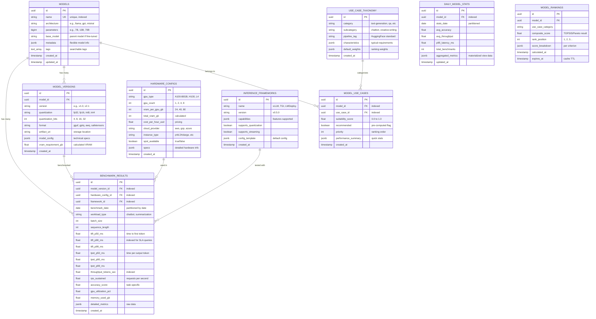

# Database Architecture

## Database Schema (ERD)

### Core Entities



## Schema Design Overview

### Entity Relationships

The database schema is designed around the core entities that support the LLM benchmarking platform with large-scale performance testing across 900+ configurations per model:

#### **Core Entities**
- **MODELS**: Base model information (GPT-4, Claude, Llama 3.1, etc.)
- **MODEL_VERSIONS**: Specific quantizations (FP16, INT8, INT4) and formats
- **HARDWARE_CONFIGS**: GPU configurations (L4, A100-80GB, H100) with pricing
- **INFERENCE_FRAMEWORKS**: vLLM, TGI, LMDeploy framework capabilities
- **BENCHMARK_RESULTS**: Time-series performance data from 900+ test combinations
- **USE_CASE_TAXONOMY**: Standardized use case categorization

#### **Performance Optimization Entities**
- **MODEL_USE_CASES**: Pre-computed model-use case suitability
- **DAILY_MODEL_STATS**: Materialized view for fast aggregations
- **MODEL_RANKINGS**: Cached TOPSIS/Pareto optimization results

### Key Design Decisions

#### **1. Normalized Model Structure**
- **MODELS** table stores base model information
- **MODEL_VERSIONS** handles different quantizations (FP16, INT8, INT4, AWQ)
- **VRAM calculation** formula: `(params × bits/8) × 1.2` stored per version
- **Artifact URI** points to storage location (S3, HuggingFace Hub)

#### **2. Time-Series Benchmark Data**
- **BENCHMARK_RESULTS** partitioned by date for TimescaleDB optimization
- **Percentile metrics** (P50, P90, P99) for SLA compliance
- **Indexed fields** for fast filtering: `ttft_p90_ms`, `throughput_tokens_sec`
- **Workload types** standardize benchmarking scenarios

#### **3. Use Case Taxonomy**
- **HuggingFace pipeline tags** for interoperability
- **Default weights** for TOPSIS algorithm
- **Characteristics** define typical requirements per use case

#### **4. Performance Optimization**
- **Pre-computed rankings** with TTL for cache invalidation
- **Materialized views** for daily aggregations
- **Indexed foreign keys** for fast joins

## Database Design Principles

### Performance Optimization


### Indexing Strategy

```sql
-- Performance-critical indexes for recommendation queries
CREATE INDEX idx_benchmark_results_model_hardware_framework 
ON benchmark_results (model_version_id, hardware_config_id, framework_id, benchmark_date DESC);

CREATE INDEX idx_benchmark_results_latency_sla 
ON benchmark_results (ttft_p90_ms, throughput_tokens_sec) 
WHERE ttft_p90_ms <= 300; -- SLA threshold

CREATE INDEX idx_models_use_cases_suitability 
ON model_use_cases (model_id, use_case_id, suitability_score DESC);

CREATE INDEX idx_model_rankings_use_case 
ON model_rankings (use_case_category, composite_score DESC, calculated_at DESC);

-- Time-series optimization indexes
CREATE INDEX idx_benchmark_results_date_workload 
ON benchmark_results (benchmark_date, workload_type);

CREATE INDEX idx_daily_stats_model_date 
ON daily_model_stats (model_id, stats_date DESC);

-- Hardware configuration indexes
CREATE INDEX idx_hardware_configs_vram_cost 
ON hardware_configs (total_vram_gb, cost_per_hour_usd, spot_available);

-- Model version indexes
CREATE INDEX idx_model_versions_vram_quantization 
ON model_versions (vram_requirement_gb, quantization_bits, format);

-- Partial indexes for active/recommended data
CREATE INDEX idx_recommended_models 
ON model_use_cases (model_id, recommended) WHERE recommended = true;

CREATE INDEX idx_active_rankings 
ON model_rankings (use_case_category, rank_position) 
WHERE expires_at > NOW();
```

## Data Flow Architecture

### Write Path


### Read Path


## Data Partitioning Strategy

### Time-Based Partitioning

```sql
-- TimescaleDB hypertables for time-series data
CREATE TABLE benchmark_results (
    id UUID PRIMARY KEY,
    config_id UUID REFERENCES benchmark_configs(id),
    latency_ms DECIMAL,
    throughput_tps DECIMAL,
    memory_usage_gb DECIMAL,
    benchmarked_at TIMESTAMPTZ NOT NULL
);

-- Create hypertable with 1-day chunks
SELECT create_hypertable('benchmark_results', 'benchmarked_at', 
    chunk_time_interval => INTERVAL '1 day');
```

### Horizontal Partitioning

```sql
-- Partition by model framework
CREATE TABLE benchmark_configs (
    id UUID,
    model_id UUID,
    hardware_id UUID,
    framework VARCHAR(50),
    -- other columns
) PARTITION BY HASH (model_id);

-- Create partitions for each framework
CREATE TABLE benchmark_configs_llama PARTITION OF benchmark_configs
    FOR VALUES WITH (MODULUS 4, REMAINDER 0);

CREATE TABLE benchmark_configs_gpt PARTITION OF benchmark_configs
    FOR VALUES WITH (MODULUS 4, REMAINDER 1);
```

## Caching Strategy

### Redis Cache Layers


### Cache Key Strategy

```python
# Cache key patterns
CACHE_KEYS = {
    "model_details": "model:{model_id}:details",
    "benchmark_results": "benchmark:{model_id}:{hardware_id}:results",
    "recommendations": "rec:{user_id}:{use_case}:recommendations",
    "hardware_list": "hardware:list:active",
    "model_metrics": "metrics:model:{model_id}:aggregated"
}

# Cache TTL configuration
CACHE_TTL = {
    "model_details": 3600,  # 1 hour
    "benchmark_results": 1800,  # 30 minutes
    "recommendations": 900,  # 15 minutes
    "hardware_list": 7200,  # 2 hours
    "model_metrics": 600  # 10 minutes
}
```

## Data Consistency

### Eventual Consistency Model


## Backup & Recovery

### Backup Strategy


### Recovery Time Objectives

- **RTO (Recovery Time)**: < 4 hours
- **RPO (Recovery Point)**: < 1 hour
- **Backup Retention**: 30 days full, 1 year incremental
- **Cross-Region Replication**: Real-time for critical data
