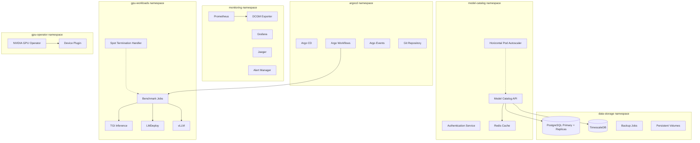
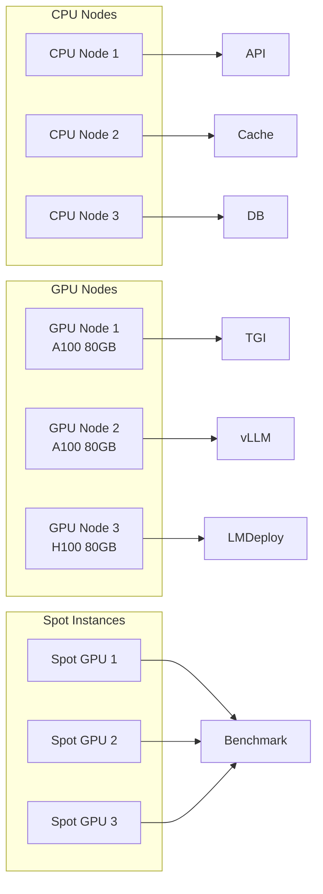
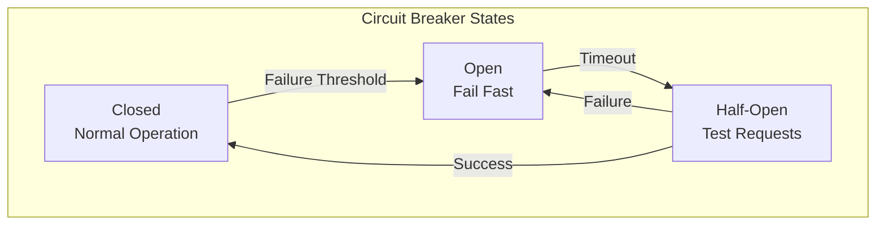
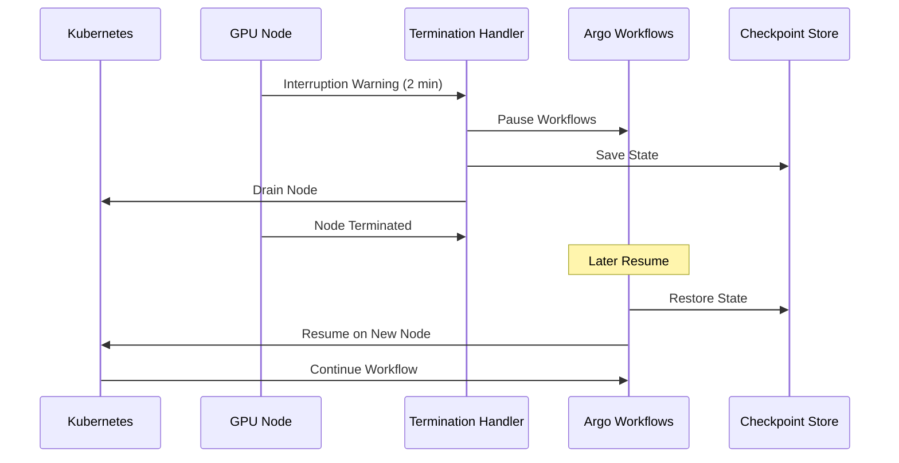

# Infrastructure Architecture

## Kubernetes Deployment Architecture

### Complete Cluster Architecture

For the detailed Kubernetes deployment architecture with all components, resource allocations, and network flows, see: **[Kubernetes Deployment Diagram](diagrams/kubernetes-deployment.md)**

### Namespace Structure



### Resource Allocation



## Service Mesh Architecture

### Istio Configuration

```yaml
# Traffic Management
apiVersion: networking.istio.io/v1alpha3
kind: VirtualService
metadata:
  name: model-catalog
spec:
  hosts:
  - model-catalog
  http:
  - match:
    - uri:
        prefix: /api/v1/models
    route:
    - destination:
        host: model-catalog
        subset: v1
    fault:
      delay:
        percentage:
          value: 0.1
        fixedDelay: 5s
  - match:
    - uri:
        prefix: /api/v1/benchmarks
    route:
    - destination:
        host: model-catalog
        subset: v2
```

### Circuit Breaker Pattern



## Spot Instance Management

### Interruption Handling



### Fault Tolerance Strategy

- **Preemption Detection**: AWS/GCP interruption warnings
- **Graceful Shutdown**: 2-minute warning window
- **State Persistence**: Checkpoint critical data
- **Automatic Recovery**: Resume on new spot instances
- **Cost Optimization**: 60-90% savings with minimal disruption

## Monitoring & Observability

### Prometheus Metrics

```yaml
# Custom Metrics
apiVersion: monitoring.coreos.com/v1
kind: ServiceMonitor
metadata:
  name: model-catalog-metrics
spec:
  selector:
    matchLabels:
      app: model-catalog-backend
  endpoints:
  - port: metrics
    path: /metrics
    interval: 30s
```

### Grafana Dashboards

- **API Performance**: Response times, error rates, throughput
- **GPU Utilization**: Memory usage, compute utilization
- **Cache Performance**: Hit ratio, eviction rates
- **Cost Tracking**: Spot instance savings, resource costs

## Network Policies

### Micro-segmentation

```yaml
apiVersion: networking.k8s.io/v1
kind: NetworkPolicy
metadata:
  name: model-catalog-netpol
spec:
  podSelector:
    matchLabels:
      app: model-catalog-backend
  policyTypes:
  - Ingress
  - Egress
  ingress:
  - from:
    - namespaceSelector:
        matchLabels:
          name: ingress-nginx
    ports:
    - protocol: TCP
      port: 8000
  egress:
  - to:
    - namespaceSelector:
        matchLabels:
          name: data-storage
    ports:
    - protocol: TCP
      port: 5432
```

## Disaster Recovery

### Backup Strategy

- **Database Backups**: Daily automated backups to S3
- **Configuration Backups**: GitOps with ArgoCD
- **State Backups**: Checkpoint data in persistent storage
- **Recovery Time**: < 4 hours for full system recovery
- **Recovery Point**: < 1 hour data loss maximum
