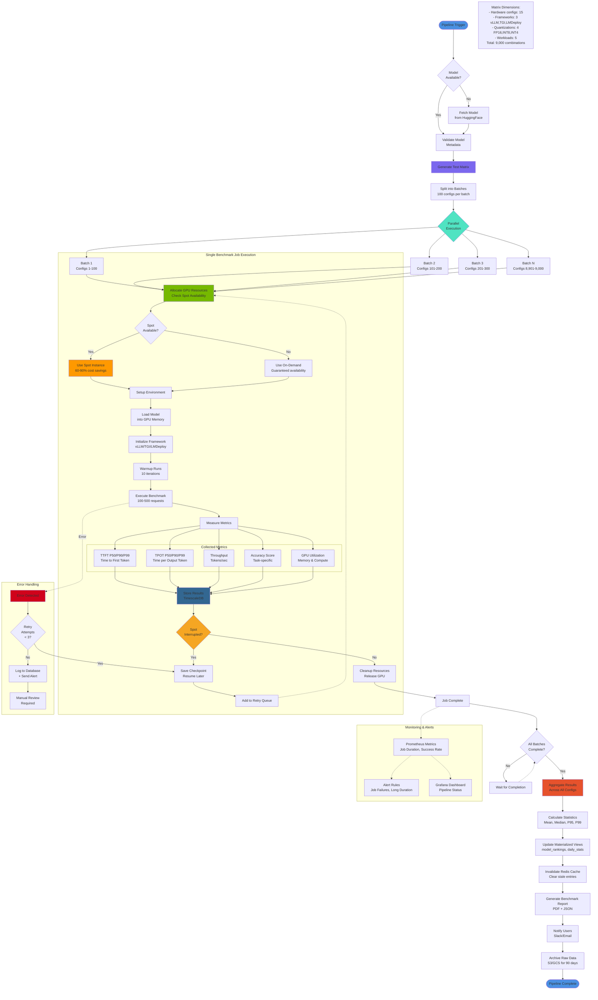
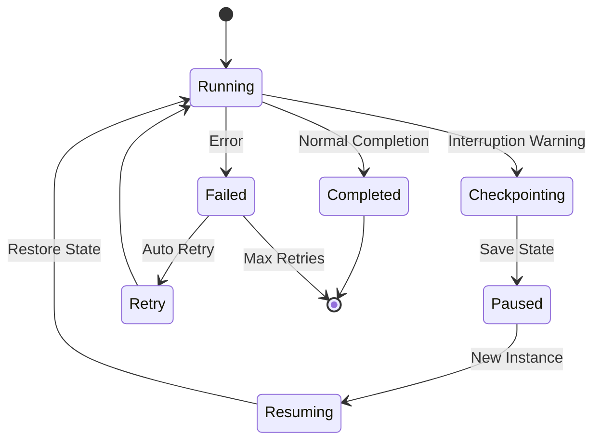
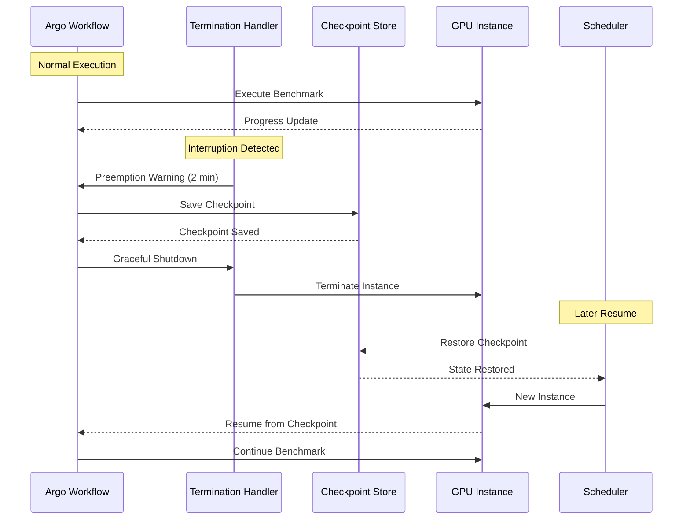
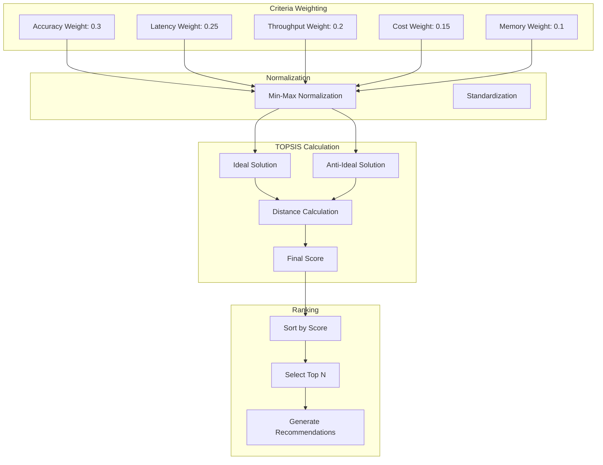
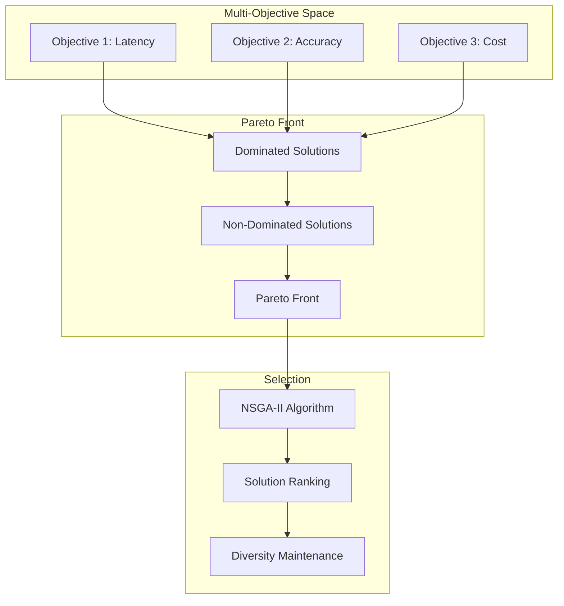
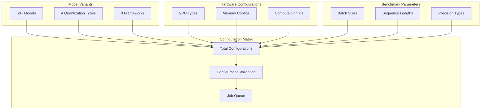
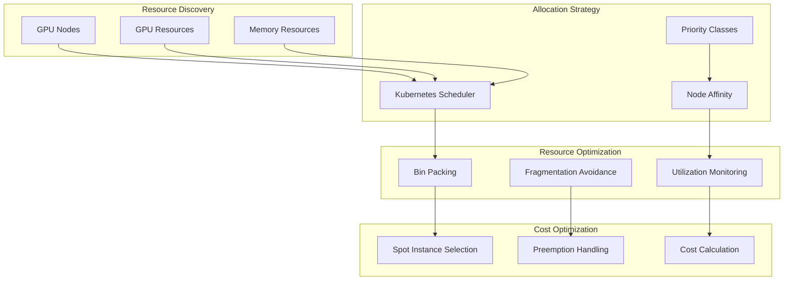
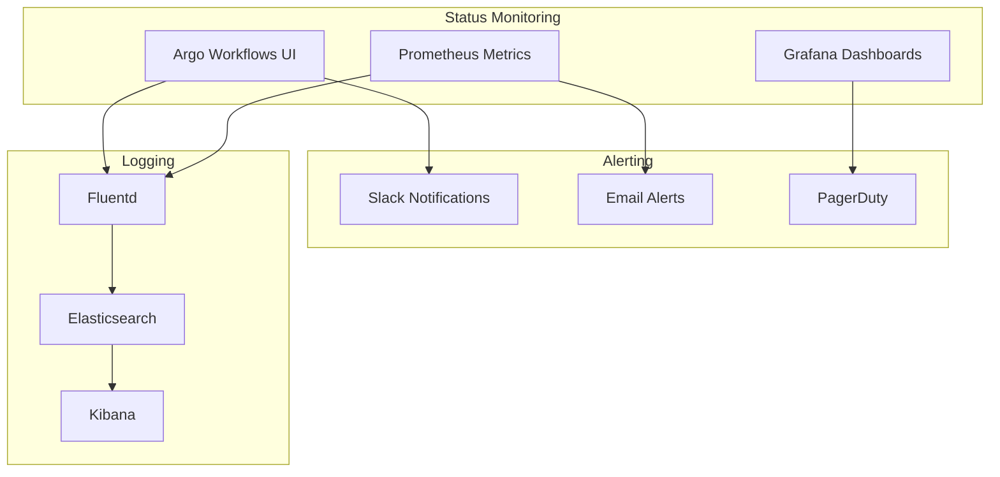
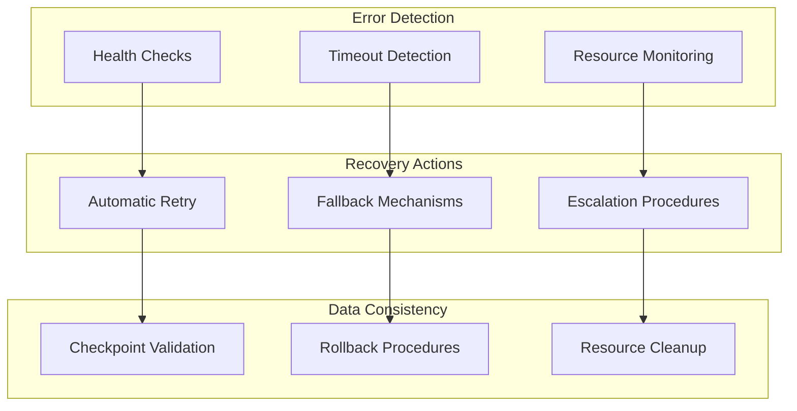

# LLM Benchmarking Pipeline Architecture

## Overview

The LLM Benchmarking Platform implements a comprehensive automation infrastructure using Argo Workflows in a Kubernetes environment. The platform handles thousands of test combinations across different hardware configurations, creating an accurate and up-to-date model catalog with 9,000+ configurations per model.

The benchmarking process is fully automated across all stages, from model validation and matrix generation to parallel execution and results collection, optimized for large-scale performance testing.

## Argo Workflows Pipeline Flow

### Complete Benchmarking Pipeline



## Spot Instance Handling

### Interruption-Aware Workflow



### Checkpoint/Resume Mechanism



## Multi-Criteria Optimization

### TOPSIS Algorithm Implementation



### Pareto Optimization



## Configuration Generation

### 9,000+ Configuration Matrix



## Resource Allocation

### GPU Resource Management



## Pipeline Monitoring

### Workflow Status Tracking



### Performance Metrics

```yaml
# Custom metrics for pipeline monitoring
pipeline_metrics:
  - name: benchmark_completion_rate
    type: gauge
    description: "Percentage of benchmarks completed successfully"
  
  - name: average_benchmark_duration
    type: histogram
    description: "Average time to complete a benchmark"
  
  - name: spot_instance_interruptions
    type: counter
    description: "Number of spot instance interruptions"
  
  - name: cache_hit_ratio
    type: gauge
    description: "Redis cache hit ratio percentage"
  
  - name: recommendation_accuracy
    type: gauge
    description: "Accuracy of model recommendations"
```

## Error Handling & Recovery

### Fault Tolerance Strategy



### Retry Logic

```python
# Exponential backoff retry configuration
RETRY_CONFIG = {
    "max_retries": 3,
    "base_delay": 1,  # seconds
    "max_delay": 60,  # seconds
    "exponential_base": 2,
    "jitter": True
}

# Circuit breaker configuration
CIRCUIT_BREAKER_CONFIG = {
    "failure_threshold": 5,
    "recovery_timeout": 30,  # seconds
    "half_open_max_calls": 3
}
```
