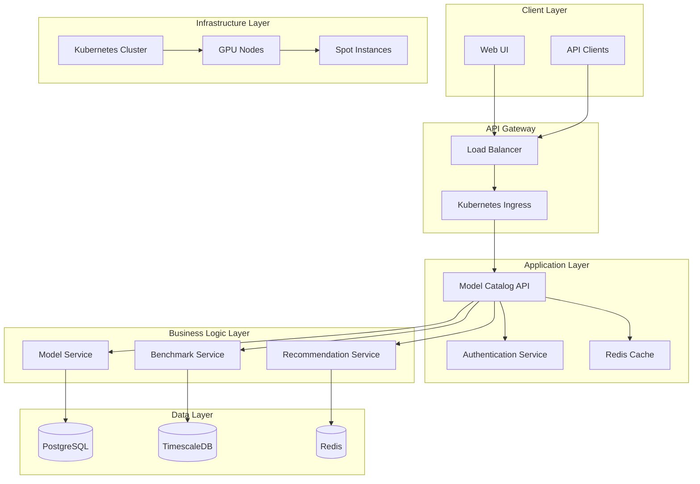
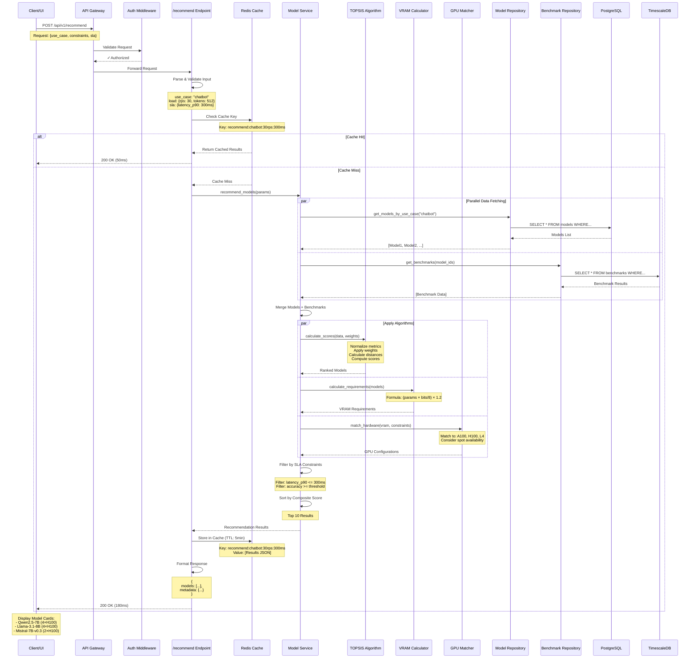
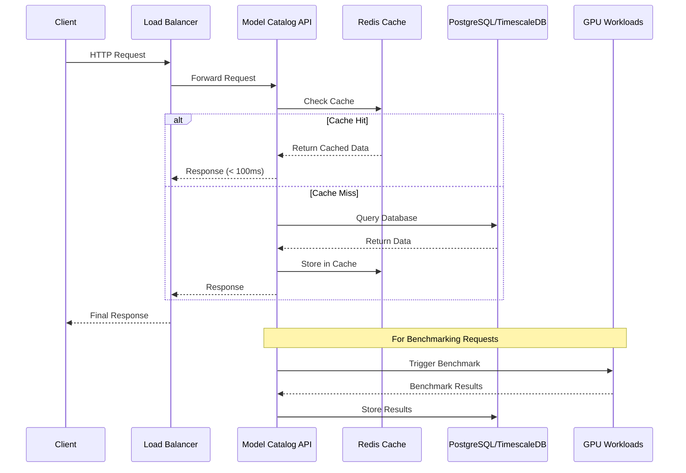
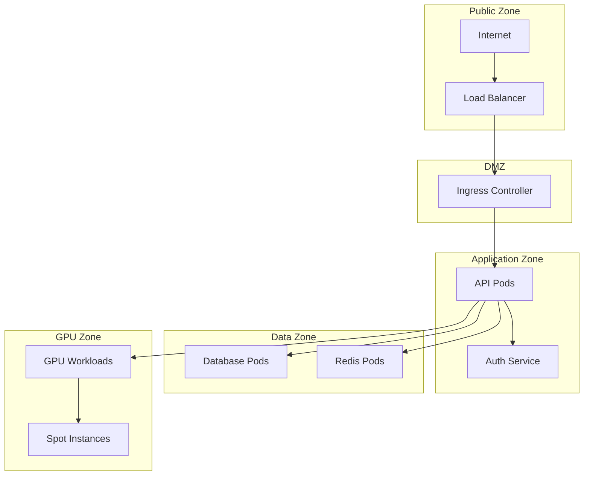
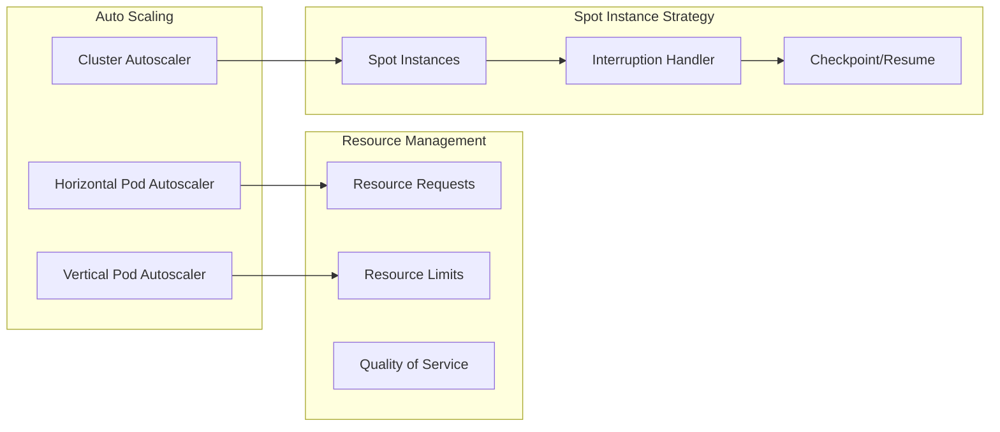

# System Architecture

## High-Level System Design

The LLM Benchmarking Platform is a comprehensive system designed for large-scale AI model performance testing and cataloging. The platform handles thousands of test combinations across different hardware configurations, creating an accurate and up-to-date model catalog with 900+ configurations per model.

The system follows a cloud-native microservices architecture with clear separation of concerns and horizontal scalability, optimized for handling the complex benchmarking matrix across multiple dimensions.

### Core Components

## Request Flow Architecture

### Recommendation Request Flow

### General API Request Flow

### Benchmarking Complexity and Test Matrix

The platform handles a complex test matrix with 900+ combinations per model across multiple dimensions:

### Test Matrix Dimensions

| Dimension | Examples | Description |
|-----------|----------|-------------|
| **Models & Versions** | GPT-4, Claude, Llama 3.1 | Different versions of language models |
| **Hardware Configs** | L4, A100-80GB, H100 | GPU types and counts (1, 2, 4, 8) |
| **Frameworks** | vLLM, TGI, LMDeploy | Different inference engines |
| **Quantization** | FP16, INT8, INT4 | Numerical precision levels |
| **Workload Patterns** | Concurrent requests, Batch sizes | Different usage scenarios |

### Performance Targets

- **P95 API Latency**: < 100ms
- **UI Filtering Response**: < 500ms
- **Cache Hit Ratio**: > 80%
- **Throughput**: 1,000-2,000 queries/hour
- **Batch Processing**: Hours/days for 9,000+ configurations
- **GPU Resource Allocation**: Dedicated full GPU per job (no resource sharing)
- **Spot Instance Utilization**: 60-90% cost savings with automatic recovery

## Security Architecture

### Network Segmentation

### Security Controls

- **Pod Security Standards**: Restricted policy enforcement
- **NetworkPolicy**: Default deny-all with explicit allow rules
- **External Secrets Operator**: Credential management
- **Network Isolation**: Separate namespaces for each component
- **TLS Encryption**: All internal and external communications

## Scalability Architecture

### Horizontal Scaling Strategy

### Cost Optimization

- **Spot Instances**: 60-90% cost savings on GPU workloads
- **Resource Optimization**: Right-sized containers
- **Efficient Caching**: Reduced database load
- **Batch Processing**: Optimal resource utilization
