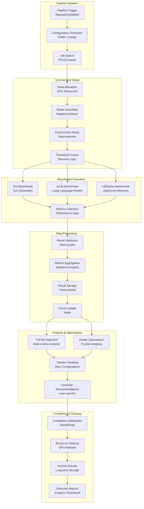
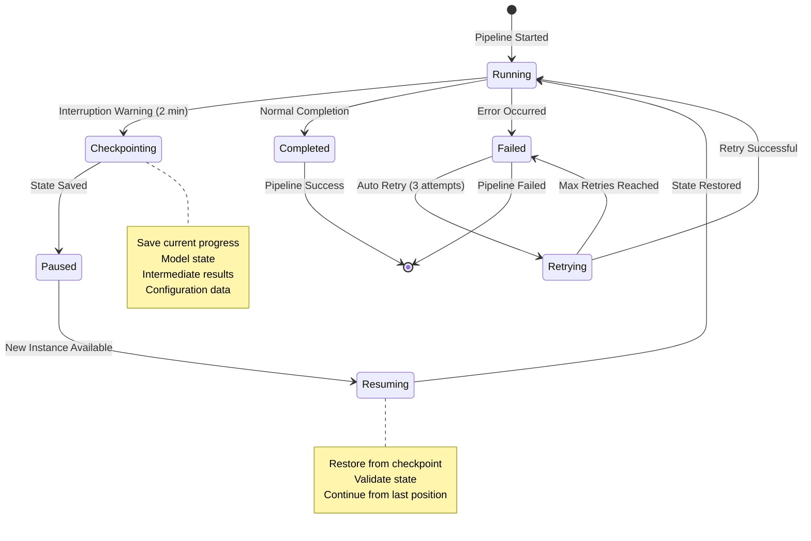
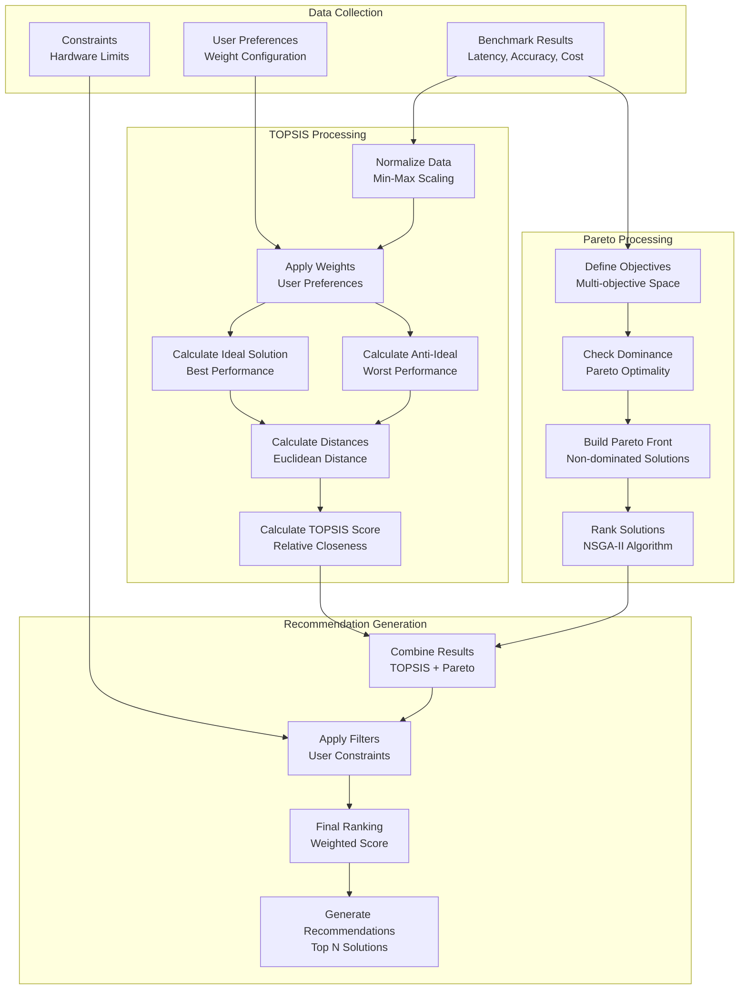
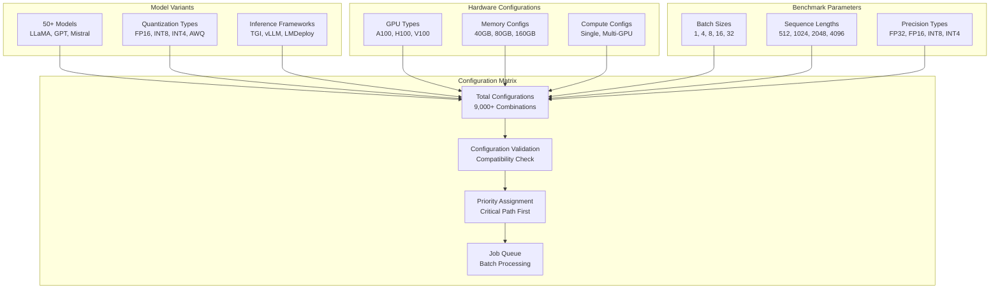
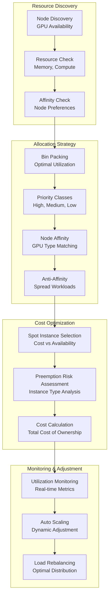

# Benchmarking Pipeline Flow

## Complete Argo Workflows Pipeline

## Spot Instance Interruption Handling

## Multi-Criteria Optimization Flow

## Configuration Matrix Generation

## Resource Allocation Strategy

