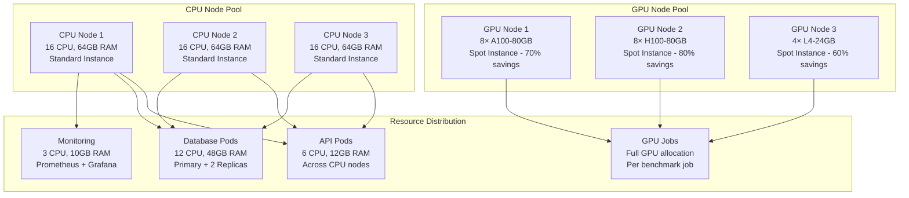
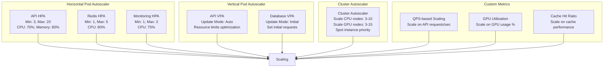
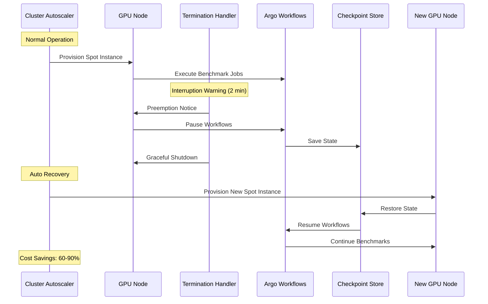

# Kubernetes Deployment Architecture

## Complete Cluster Architecture

```mermaid
graph TB
    subgraph "External Access"
        Internet[Internet Traffic]
        LoadBalancer[Cloud Load Balancer]
    end

    subgraph "Kubernetes Cluster"
        subgraph "Ingress Layer"
            Ingress[NGINX Ingress Controller]
        end

        subgraph "Namespace: model-catalog"
            subgraph "API Deployment"
                APIPod1[API Pod 1<br/>2 CPU, 4GB RAM]
                APIPod2[API Pod 2<br/>2 CPU, 4GB RAM]
                APIPod3[API Pod 3<br/>2 CPU, 4GB RAM]
                HPA[Horizontal Pod Autoscaler<br/>Min: 3, Max: 20<br/>Target: 70% CPU]
            end

            APIService[Service: api-service<br/>Type: ClusterIP<br/>Port: 8000]

            subgraph "Configuration"
                ConfigMap[ConfigMap<br/>- DATABASE_URL<br/>- REDIS_URL<br/>- LOG_LEVEL]
                Secrets[Secrets<br/>- DB_PASSWORD<br/>- SECRET_KEY<br/>- API_KEYS]
            end

            subgraph "Cache Layer"
                RedisMaster[Redis Master<br/>1 CPU, 2GB RAM]
                RedisReplica1[Redis Replica 1]
                RedisReplica2[Redis Replica 2]
                RedisService[Service: redis-service]
            end
        end

        subgraph "Namespace: data-storage"
            subgraph "Database StatefulSet"
                PGPrimary[PostgreSQL Primary<br/>4 CPU, 16GB RAM<br/>PVC: 500GB SSD]
                PGReplica1[PostgreSQL Replica 1<br/>4 CPU, 16GB RAM]
                PGReplica2[PostgreSQL Replica 2<br/>4 CPU, 16GB RAM]
            end

            PGService[Service: postgres-service<br/>Headless Service]
            PGPersistentVolume[PersistentVolume<br/>StorageClass: ssd<br/>500GB per replica]
        end

        subgraph "Namespace: gpu-workloads"
            subgraph "GPU Node Pool - Spot Instances"
                GPUNode1[GPU Node 1<br/>8× A100-80GB<br/>Spot Instance]
                GPUNode2[GPU Node 2<br/>8× H100<br/>Spot Instance]
                GPUNode3[GPU Node 3<br/>4× L4<br/>Spot Instance]
            end

            subgraph "Benchmark Jobs"
                BenchJob1[Benchmark Job 1<br/>GPU: 1<br/>Model: Llama-3.1-70B]
                BenchJob2[Benchmark Job 2<br/>GPU: 4<br/>Model: Qwen2.5-72B]
                BenchJob3[Benchmark Job 3<br/>GPU: 1<br/>Model: Mistral-7B]
            end

            NodeTerminationHandler[AWS Node Termination Handler<br/>DaemonSet<br/>Handles Spot Interruptions]
        end

        subgraph "Namespace: argocd"
            ArgoCDServer[Argo CD Server<br/>GitOps Controller]
            ArgoRepo[Git Repository<br/>Source of Truth]
        end

        subgraph "Namespace: argo-workflows"
            ArgoController[Argo Workflows Controller]
            ArgoUI[Argo Workflows UI]
            WorkflowTemplate[Workflow Templates<br/>Benchmark Pipeline]
        end

        subgraph "Namespace: monitoring"
            PrometheusServer[Prometheus Server<br/>2 CPU, 8GB RAM<br/>PVC: 200GB]
            GrafanaServer[Grafana Server<br/>1 CPU, 2GB RAM]
            DCGMExporter[DCGM Exporter<br/>DaemonSet on GPU nodes]
            AlertManager[Alert Manager<br/>Slack/PagerDuty]
        end

        subgraph "Namespace: gpu-operator"
            GPUOperator[NVIDIA GPU Operator<br/>Manages GPU drivers]
            DevicePlugin[Device Plugin<br/>Exposes GPUs to K8s]
        end
    end

    Internet --> LoadBalancer
    LoadBalancer --> Ingress
    Ingress --> APIService
    APIService --> APIPod1
    APIService --> APIPod2
    APIService --> APIPod3

    HPA -.-> APIPod1
    HPA -.-> APIPod2
    HPA -.-> APIPod3

    APIPod1 --> ConfigMap
    APIPod1 --> Secrets
    APIPod2 --> ConfigMap
    APIPod2 --> Secrets
    APIPod3 --> ConfigMap
    APIPod3 --> Secrets

    APIPod1 --> RedisService
    APIPod2 --> RedisService
    APIPod3 --> RedisService

    RedisService --> RedisMaster
    RedisService --> RedisReplica1
    RedisService --> RedisReplica2

    APIPod1 --> PGService
    APIPod2 --> PGService
    APIPod3 --> PGService

    PGService --> PGPrimary
    PGService --> PGReplica1
    PGService --> PGReplica2

    PGPrimary --> PGPersistentVolume
    PGReplica1 --> PGPersistentVolume
    PGReplica2 --> PGPersistentVolume

    ArgoController --> WorkflowTemplate
    WorkflowTemplate --> BenchJob1
    WorkflowTemplate --> BenchJob2
    WorkflowTemplate --> BenchJob3

    BenchJob1 --> GPUNode1
    BenchJob2 --> GPUNode2
    BenchJob3 --> GPUNode3

    NodeTerminationHandler -.-> GPUNode1
    NodeTerminationHandler -.-> GPUNode2
    NodeTerminationHandler -.-> GPUNode3

    GPUOperator --> DevicePlugin
    DevicePlugin -.-> GPUNode1
    DevicePlugin -.-> GPUNode2
    DevicePlugin -.-> GPUNode3

    BenchJob1 --> PGService
    BenchJob2 --> PGService
    BenchJob3 --> PGService

    DCGMExporter -.-> GPUNode1
    DCGMExporter -.-> GPUNode2
    DCGMExporter -.-> GPUNode3

    PrometheusServer --> DCGMExporter
    PrometheusServer --> APIPod1
    PrometheusServer --> RedisMaster
    PrometheusServer --> PGPrimary

    GrafanaServer --> PrometheusServer
    PrometheusServer --> AlertManager

    ArgoCDServer --> ArgoRepo
    ArgoCDServer -.-> APIPod1
    ArgoCDServer -.-> ArgoController

    style Ingress fill:#4A90E2
    style APIPod1 fill:#7B68EE
    style APIPod2 fill:#7B68EE
    style APIPod3 fill:#7B68EE
    style PGPrimary fill:#336791
    style RedisMaster fill:#DC382D
    style GPUNode1 fill:#76B900
    style GPUNode2 fill:#76B900
    style GPUNode3 fill:#76B900
    style PrometheusServer fill:#E6522C
    style ArgoCDServer fill:#F26D21
    style HPA fill:#50E3C2
```

## Namespace Isolation Strategy

```mermaid
graph TB
    subgraph "Network Policies"
        NetPol1[model-catalog NetPol<br/>Allow ingress from ingress-nginx<br/>Allow egress to data-storage]
        NetPol2[data-storage NetPol<br/>Allow ingress from model-catalog<br/>Default deny all]
        NetPol3[gpu-workloads NetPol<br/>Allow ingress from argo-workflows<br/>Allow egress to data-storage]
        NetPol4[monitoring NetPol<br/>Allow ingress from all namespaces<br/>Allow egress to all namespaces]
    end
    
    subgraph "Pod Security Standards"
        Restricted[Restricted Policy<br/>model-catalog, data-storage]
        Baseline[Baseline Policy<br/>gpu-workloads, monitoring]
        Privileged[Privileged Policy<br/>gpu-operator only]
    end
    
    subgraph "RBAC Configuration"
        APIRole[API Service Account<br/>Read/Write models, benchmarks]
        GPURole[GPU Job Service Account<br/>Read models, Write results]
        MonitorRole[Monitoring Service Account<br/>Read metrics from all namespaces]
        ArgoRole[ArgoCD Service Account<br/>Manage deployments]
    end
    
    NetPol1 --> Isolation
    NetPol2 --> Isolation
    NetPol3 --> Isolation
    NetPol4 --> Isolation
    
    Restricted --> Isolation
    Baseline --> Isolation
    Privileged --> Isolation
    
    APIRole --> Isolation
    GPURole --> Isolation
    MonitorRole --> Isolation
    ArgoRole --> Isolation
```

## Resource Allocation Strategy

## Auto-Scaling Configuration

## Spot Instance Management

