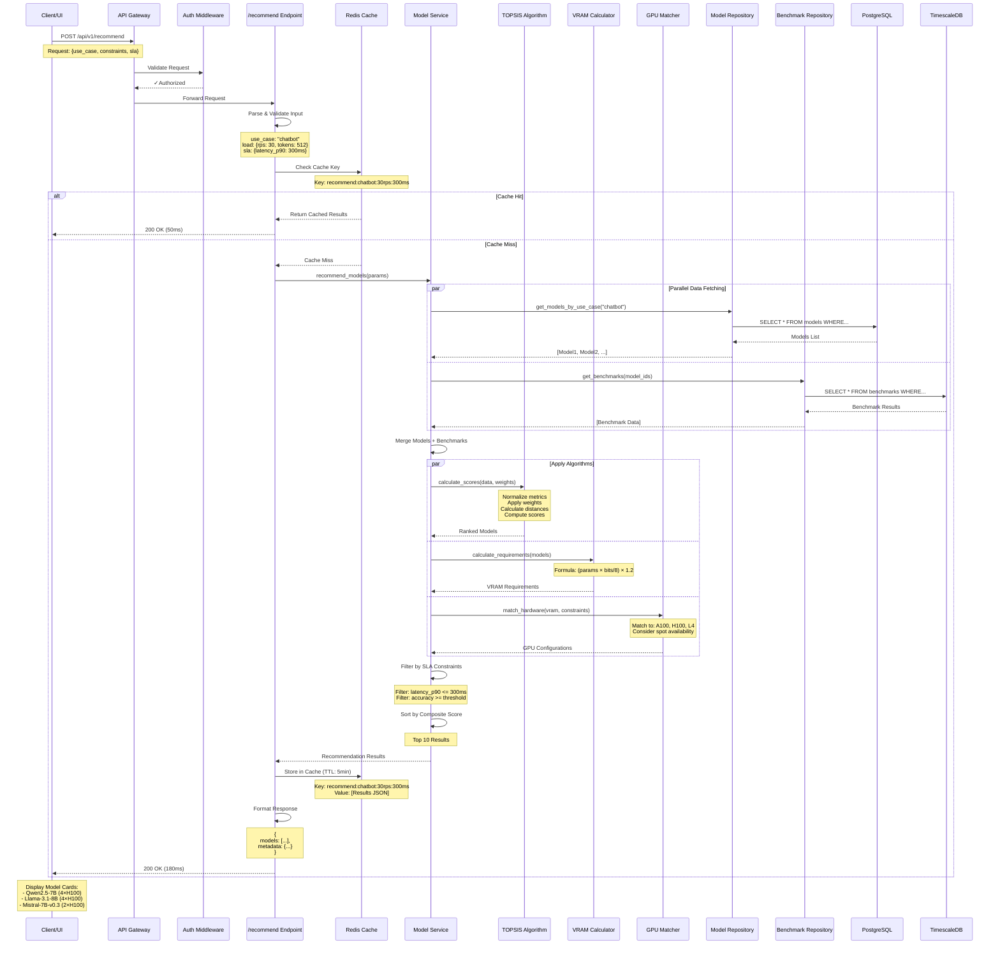
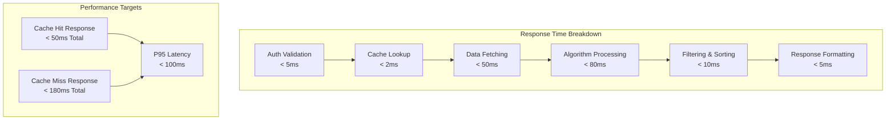
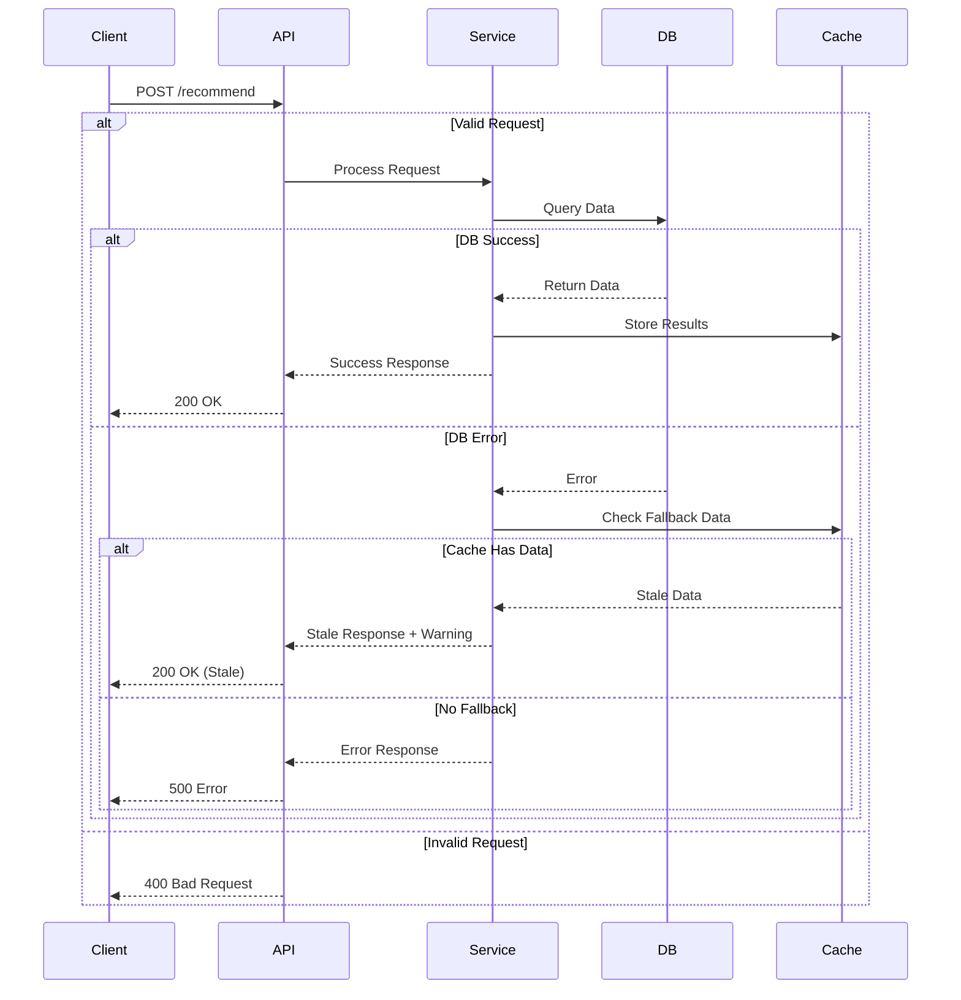

# Recommendation System Flow

## Complete Recommendation Request Flow



## Performance Targets by Flow Stage



## Cache Strategy for Recommendations

```mermaid
graph TB
    subgraph "Cache Key Strategy"
        UseCase[Use Case<br/>chatbot, summarization]
        Load[Load Profile<br/>rps, tokens, batch_size]
        SLA[SLA Requirements<br/>latency, accuracy]
        Key[Cache Key<br/>recommend:{use_case}:{load}:{sla}]
    end
    
    subgraph "Cache TTL Strategy"
        Hot[Hot Data<br/>TTL: 5 minutes<br/>High frequency requests]
        Warm[Warm Data<br/>TTL: 30 minutes<br/>Medium frequency]
        Cold[Cold Data<br/>TTL: 2 hours<br/>Low frequency]
    end
    
    subgraph "Cache Invalidation"
        ModelUpdate[Model Updates<br/>Invalidate model cache]
        BenchmarkUpdate[New Benchmarks<br/>Invalidate recommendations]
        ConfigUpdate[Config Changes<br/>Invalidate all]
    end
    
    UseCase --> Key
    Load --> Key
    SLA --> Key
    
    Key --> Hot
    Key --> Warm
    Key --> Cold
    
    ModelUpdate --> ConfigUpdate
    BenchmarkUpdate --> ConfigUpdate
```

## Error Handling Flow



## Resource Optimization Flow

```mermaid
graph TB
    subgraph "VRAM Calculation"
        Params[Model Parameters<br/>7B, 13B, 70B]
        Quantization[Quantization<br/>FP16, INT8, INT4, AWQ]
        Formula[VRAM Formula<br/>(params × bits/8) × 1.2]
        VRAM[VRAM Requirements<br/>GB]
    end
    
    subgraph "GPU Matching"
        GPU[Available GPUs<br/>A100, H100, L4, V100]
        Spot[Spot Availability<br/>Cost optimization]
        Match[Hardware Match<br/>VRAM + Compute]
    end
    
    subgraph "Cost Optimization"
        SpotCost[Spot Instance Cost<br/>60-90% savings]
        ReservedCost[Reserved Instance Cost<br/>Predictable pricing]
        TotalCost[Total Cost of Ownership<br/>TCO calculation]
    end
    
    Params --> Formula
    Quantization --> Formula
    Formula --> VRAM
    
    VRAM --> Match
    GPU --> Match
    Spot --> Match
    
    Match --> SpotCost
    Match --> ReservedCost
    SpotCost --> TotalCost
    ReservedCost --> TotalCost
```
