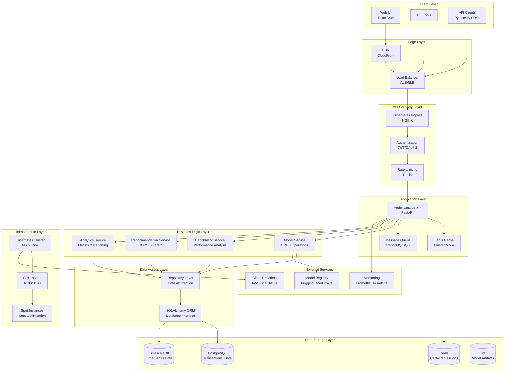
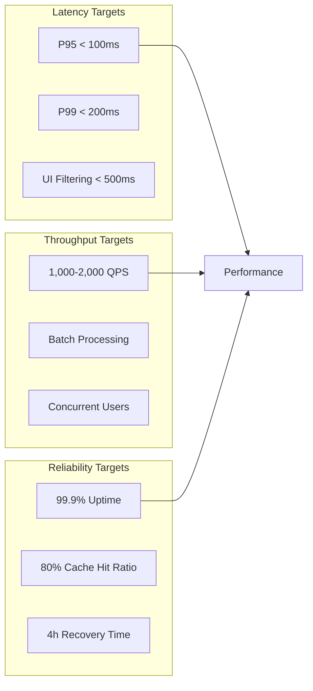
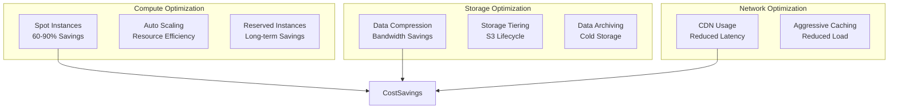

# System Overview Architecture

## High-Level System Design

```mermaid
graph TB
    subgraph "Client Layer"
        UI[Web UI<br/>React/Vue]
        CLI[CLI Tools]
        API_Client[API Clients<br/>Python/JS SDKs]
    end
    
    subgraph "Edge Layer"
        CDN[CDN<br/>CloudFront]
        LB[Load Balancer<br/>ALB/NLB]
    end
    
    subgraph "API Gateway Layer"
        Ingress[Kubernetes Ingress<br/>NGINX]
        Auth[Authentication<br/>JWT/OAuth2]
        RateLimit[Rate Limiting<br/>Redis]
    end
    
    subgraph "Application Layer"
        API[Model Catalog API<br/>FastAPI]
        Cache[Redis Cache<br/>Cluster Mode]
        Queue[Message Queue<br/>RabbitMQ/SQS]
    end
    
    subgraph "Business Logic Layer"
        ModelSvc[Model Service<br/>CRUD Operations]
        BenchmarkSvc[Benchmark Service<br/>Performance Analysis]
        RecSvc[Recommendation Service<br/>TOPSIS/Pareto]
        AnalyticsSvc[Analytics Service<br/>Metrics & Reporting]
    end
    
    subgraph "Data Access Layer"
        Repo[Repository Layer<br/>Data Abstraction]
        ORM[SQLAlchemy ORM<br/>Database Interface]
    end
    
    subgraph "Data Storage Layer"
        PG[(PostgreSQL<br/>Transactional Data)]
        TS[(TimescaleDB<br/>Time-Series Data)]
        Redis[(Redis<br/>Cache & Sessions)]
        S3[(S3<br/>Model Artifacts)]
    end
    
    subgraph "Infrastructure Layer"
        K8s[Kubernetes Cluster<br/>Multi-Zone]
        GPU[GPU Nodes<br/>A100/H100]
        Spot[Spot Instances<br/>Cost Optimization]
    end
    
    subgraph "External Services"
        Registry[Model Registry<br/>HuggingFace/Private]
        Cloud[Cloud Providers<br/>AWS/GCP/Azure]
        Monitoring[Monitoring<br/>Prometheus/Grafana]
    end
    
    %% Client connections
    UI --> CDN
    CLI --> LB
    API_Client --> LB
    
    %% Edge to Gateway
    CDN --> LB
    LB --> Ingress
    
    %% Gateway to Application
    Ingress --> Auth
    Auth --> RateLimit
    RateLimit --> API
    
    %% Application connections
    API --> Cache
    API --> Queue
    API --> ModelSvc
    API --> BenchmarkSvc
    API --> RecSvc
    API --> AnalyticsSvc
    
    %% Business Logic to Data Access
    ModelSvc --> Repo
    BenchmarkSvc --> Repo
    RecSvc --> Repo
    AnalyticsSvc --> Repo
    
    %% Data Access to Storage
    Repo --> ORM
    ORM --> PG
    ORM --> TS
    Cache --> Redis
    
    %% Infrastructure connections
    K8s --> GPU
    GPU --> Spot
    
    %% External integrations
    ModelSvc --> Registry
    K8s --> Cloud
    API --> Monitoring
```

## Performance Targets

```mermaid
graph LR
    subgraph "Latency Targets"
        P95[P95 < 100ms]
        P99[P99 < 200ms]
        UI[UI Filtering < 500ms]
    end
    
    subgraph "Throughput Targets"
        QPS[1,000-2,000 QPS]
        Batch[Batch Processing]
        Concurrent[Concurrent Users]
    end
    
    subgraph "Reliability Targets"
        Uptime[99.9% Uptime]
        Cache[80% Cache Hit Ratio]
        Recovery[4h Recovery Time]
    end
    
    P95 --> Performance
    QPS --> Performance
    Uptime --> Performance
```

## Cost Optimization Strategy

```mermaid
graph TB
    subgraph "Compute Optimization"
        Spot[Spot Instances<br/>60-90% Savings]
        AutoScale[Auto Scaling<br/>Resource Efficiency]
        Reserved[Reserved Instances<br/>Long-term Savings]
    end
    
    subgraph "Storage Optimization"
        Compression[Data Compression<br/>Storage Reduction]
        Tiering[Storage Tiering<br/>S3 Lifecycle]
        Archiving[Data Archiving<br/>Cold Storage]
    end
    
    subgraph "Network Optimization"
        CDN[CDN Usage<br/>Reduced Latency]
        Compression[Data Compression<br/>Bandwidth Savings]
        Caching[Aggressive Caching<br/>Reduced Load]
    end
    
    Spot --> CostSavings
    Compression --> CostSavings
    CDN --> CostSavings
```
